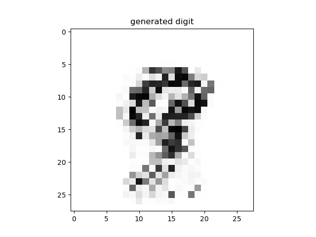
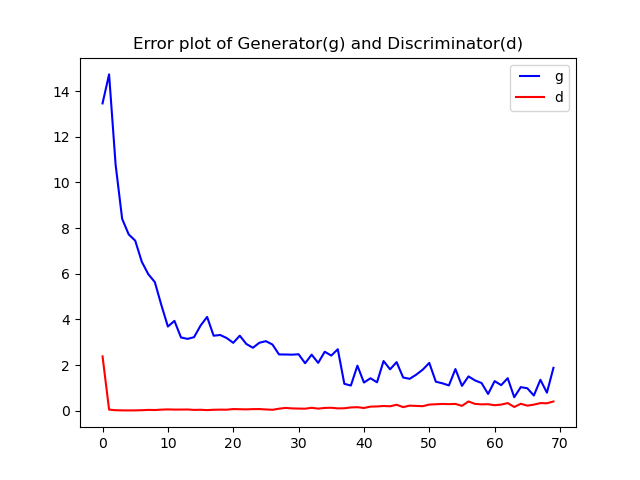

a simple Numpy based Generative adversarial network (GAN) for generating MNIST-digit nine, written using `numpy` library. this repo builded for own interest and with help of Luis Serrano's slanted GAN [video](https://youtu.be/8L11aMN5KY8), it is nice go and watch it once.

### GAN structure

* Generator: It was built by two layers, input layer with one neuron and the output layer with 784 neurons.

* Discriminator: It also built by two layers, input layer with 784 neurons and the output layer with one neuron. 

#### Data set
I used [MNIST-digits-dataset](https://www.kaggle.com/c/digit-recognizer/data) from kaggle website for training network and used only 14 nine digits.

#### Execution
* Go to `src` directory using `cd src`
* run `python main.py`

Note: Saving, trained session of Network not implemented.  

### Lang\libraries\Tools
* `Python 3.8.8`
* `numpy`
* `pickle`
* `matplotlib`

### Acknowledgments
* Luis Serrano [GAN-video](https://youtu.be/8L11aMN5KY8) , [slanted-land-gan-repo](https://github.com/luisguiserrano/gans)
* MNIST-Digits [data set](https://www.kaggle.com/c/digit-recognizer/data)
* MIT and Standford GAN Lectures from Youtube
* Ian Goodfellow paper

